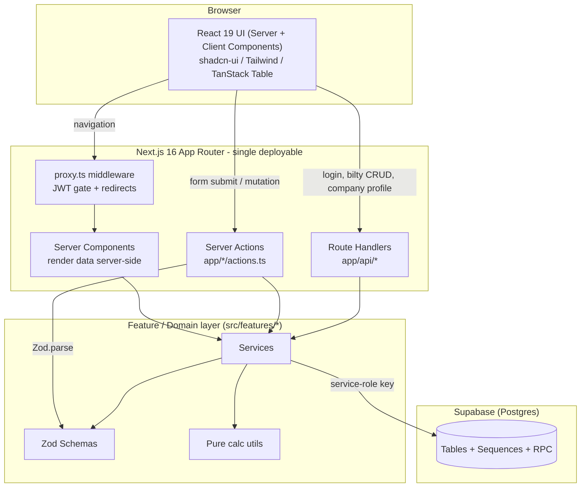
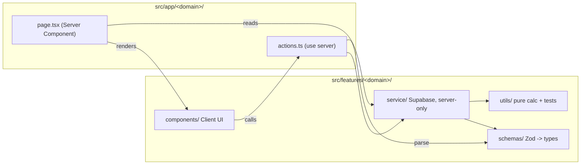
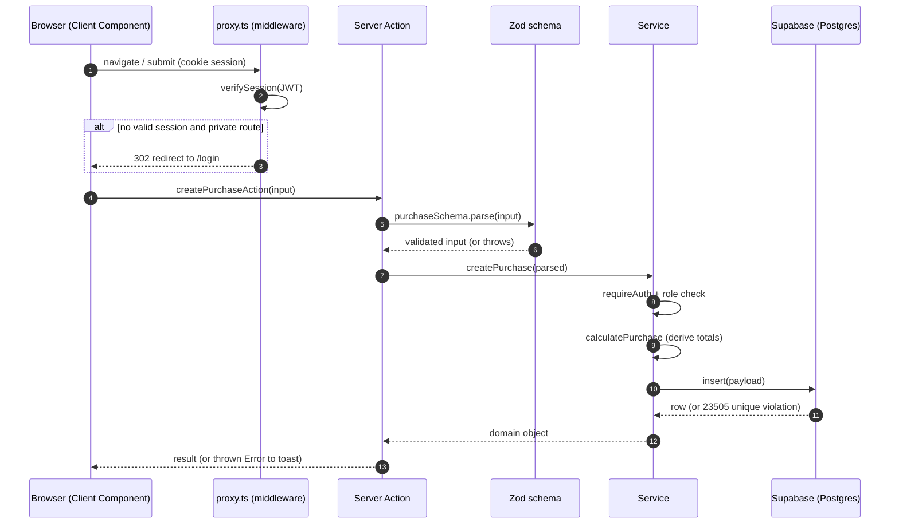
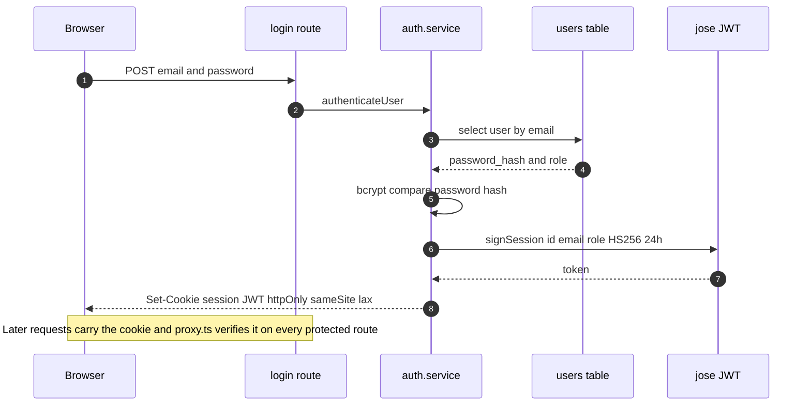
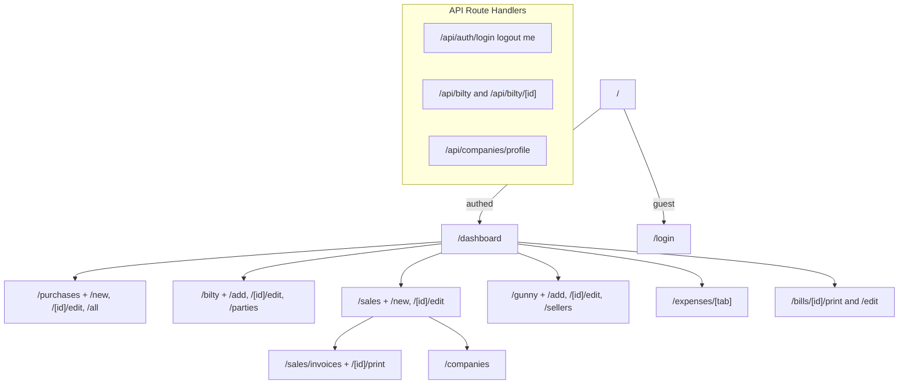
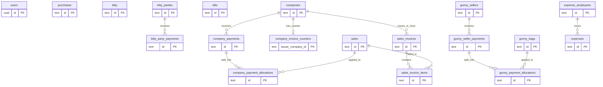
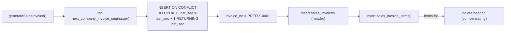

# PB Manager — System Architecture

> Internal management system for a grain/maize trading business (branded **MB Groups**).
> Tracks **purchases**, **bilty** (transport consignments), **sales**, **billing/invoicing**,
> **expenses**, and **gunny bags** (jute sacks), with payment tracking and Excel import/export.

| | |
|---|---|
| **Framework** | Next.js 16 (App Router) · React 19 · TypeScript |
| **Database** | Supabase (Postgres), accessed server-side via service-role key |
| **Validation** | Zod (schemas are the source of truth for types) |
| **UI** | Tailwind v4 · shadcn-ui · TanStack Table |
| **Auth** | JWT in an httpOnly cookie (jose) + bcrypt password hashing |
| **Rendering** | Server Components by default; Client Components only for interactive tables/forms |

> 📊 **Diagrams** are committed as rendered SVGs under [`docs/diagrams/`](diagrams/) so they display
> in any viewer. Each diagram's editable Mermaid source sits next to it as a `.mmd` file and is also
> embedded in a collapsible block below it. To regenerate after editing, see [§11](#11-regenerating-the-diagrams).

---

## 1. High-level architecture

There is no separate backend service. **Next.js *is* the backend.** The browser never talks to
Supabase directly — every read/write goes through the server (a Server Action or a Route Handler)
using the **service-role key**, which never ships to the client bundle.


<details><summary>Mermaid source</summary>


</details>

---

## 2. Layered design (per feature slice)

Every domain under `src/features/<domain>/` follows the **same four-part shape**. This consistency
is the backbone of the codebase — learn one slice and you know them all.


| Layer | Responsibility | Rule |
|-------|----------------|------|
| `schemas/` | Zod validation + inferred types | **Single source of truth** for shape |
| `utils/` | Pure derivations (net weight, totals) | No I/O, unit-tested |
| `service/` | All Supabase reads/writes + auth guards | Server-only; recomputes derived fields |
| `components/` | Forms & tables | Client; call Server Actions |
| `app/.../actions.ts` | Thin RPC boundary | `parse()` then delegate to service |

<details><summary>Mermaid source</summary>


</details>

---

## 3. Request lifecycle (a mutation, end-to-end)


**Notes**
- Validation happens **twice on the server**: Zod at the action boundary, then DB constraints.
- `requireAuth()` is enforced inside the service, not only in middleware → defense in depth.
- Derived fields (`net_weight`, `final_total`, …) are **recomputed server-side** on every write,
  so they can never drift from the inputs.
- Errors are thrown and surfaced to the client as toast messages (sonner).

<details><summary>Mermaid source</summary>


</details>

---

## 4. Authentication & session

- Sessions are **stateless JWTs** (no server-side session store), signed with `SESSION_SECRET`, 24h expiry.
- Roles: `admin`, `operator`. Guards: `requireAuth()`, `requireRole([...])`.
- Public routes: `/login`, `/api/auth/login`. Everything else is gated by [`proxy.ts`](../src/proxy.ts).


<details><summary>Mermaid source</summary>


</details>

---

## 5. Route map

Navigation is defined in [`src/components/layout/Sidebar.tsx`](../src/components/layout/Sidebar.tsx).


<details><summary>Mermaid source</summary>


</details>

---

## 6. Data model (ERD)

The schema lives in [`supabase/schema.sql`](../supabase/schema.sql) (18 tables + sequences + one RPC).


> **Modeling notes:** `purchases`/`bilty` carry denormalized `name/place/mob` rather than a hard FK
> to a party table. `gunny_bags.seller` is a free-text name (matched to `gunny_sellers` by name, not FK).
> The `*_payment_allocations` tables are the join between a single payment and the many records it pays.

<details><summary>Mermaid source</summary>


</details>

---

## 7. Key domain flows

### 7.1 Bill generation (idempotent)
A purchase or bilty maps to a **deterministic bill id**, so re-generating never duplicates:

```
purchase  →  bill id = "PUR_BILL_<purchaseId>"  →  upsertBillById(...)
```

Because the id is derived from the source row, the `upsert` makes the operation idempotent —
one purchase always resolves to exactly one bill.

### 7.2 Sales invoice numbering (concurrency-safe)
Invoice sequence per issuer company uses an **atomic Postgres RPC** (`next_company_invoice_seq`),
not a read-modify-write — so concurrent invoice generation can't collide. The invoice also stores a
**`snapshot_json`** of issuer/buyer/items at issue time, so printed invoices stay stable even if the
underlying company or sale rows change later.


<details><summary>Mermaid source</summary>


</details>

### 7.3 Payment allocation (gunny & companies)
Payments are recorded once and **split across multiple records** via an allocations table:

```
seller_payment (₹50,000)
   ├─ allocation → gunny_bags A : ₹30,000
   └─ allocation → gunny_bags B : ₹20,000
```

This is the pattern behind the most recent feature work (allocation-based payment tracking).

---

## 8. Cross-cutting concerns

| Concern | Where | How |
|---------|-------|-----|
| Validation | `features/*/schemas` | Zod, parsed at every action boundary |
| Money math | `features/*/utils/calculations.ts` | Pure, recomputed server-side, unit-tested |
| Auth | `features/auth/lib/session.ts`, `proxy.ts` | JWT cookie + middleware + service guards |
| Env safety | `lib/env.ts` | Zod-validated at boot; throws on missing vars |
| Financial year | `lib/financial-year.ts` | Bill numbers & stats scoped per FY |
| Excel I/O | `lib/excel/`, `xlsx` | Import legacy data (`source='manual'`), export reports |
| Number/phone fmt | `lib/number-format.ts`, `lib/phone-format.ts` | Display + `+91` normalization |

---

## 9. Known limitations / production hardening backlog

These are documented so the trade-offs are explicit. None block a small, trusted-user deployment,
but they matter at scale.

1. **No Row-Level Security.** All access uses the service-role key; the DB is protected only by the
   app layer. Add RLS + anon key for defense in depth.
2. **Read-modify-write sequences** for `purchases`/`bilty` bill numbers (race-prone; relies on a
   unique-constraint error). Move to atomic sequences like `next_company_invoice_seq`.
3. **No multi-table transactions.** Invoice header+items uses a best-effort compensating delete;
   gunny payment+allocations can orphan a payment row on partial failure. Wrap in Postgres functions.
4. **No cache revalidation** (`revalidatePath`/`revalidateTag` unused) — freshness relies on refetch.
5. **Thin tests** — only pure calc functions are covered; services/actions/auth are untested.
6. **Inconsistent error surfacing** — most actions throw raw DB error strings to the client.
7. **`SESSION_SECRET` has a dev fallback default** — must hard-fail in production.

---

## 10. Directory reference

```
src/
├── app/                    # Routes (App Router): pages, actions.ts, api/
│   ├── api/                #   Route Handlers (auth, bilty, companies/profile)
│   └── <domain>/           #   page.tsx (RSC) + actions.ts ('use server')
├── features/<domain>/      # Domain logic
│   ├── schemas/            #   Zod schemas + types  (source of truth)
│   ├── utils/              #   pure calculations (+ .test.ts)
│   ├── service/            #   Supabase data access (server-only)
│   └── components/         #   client forms & tables
├── components/             # Shared UI (ui/, layout/, shared/, auth/)
├── lib/                    # env, supabase client, financial-year, excel, formatting
└── proxy.ts                # middleware: JWT gate + redirects
supabase/schema.sql         # full DDL + seed + RPC
docs/diagrams/              # diagram sources (.mmd) + rendered (.svg)
```

---

## 11. Regenerating the diagrams

Diagram sources are the `.mmd` files in [`docs/diagrams/`](diagrams/); the committed `.svg` files are
rendered output. To regenerate after editing a `.mmd`:

```bash
# one-time: mermaid-cli is installed as a devDependency
for f in docs/diagrams/*.mmd; do
  npx mmdc -i "$f" -o "${f%.mmd}.svg" \
    -c docs/diagrams/mermaid-theme.json -b transparent
done
```

> On macOS the renderer uses the system Chrome via a Puppeteer config
> (`executablePath` → `/Applications/Google Chrome.app/...`). Adjust for your OS if needed.
</content>
