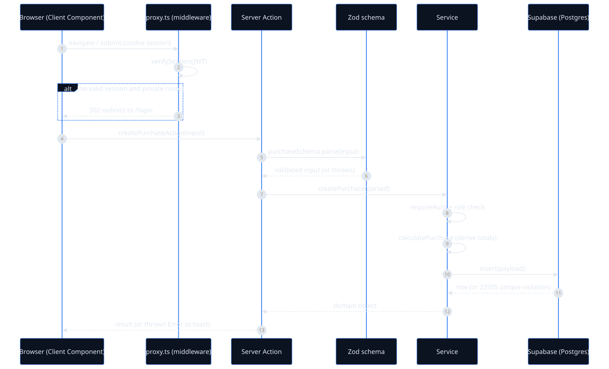
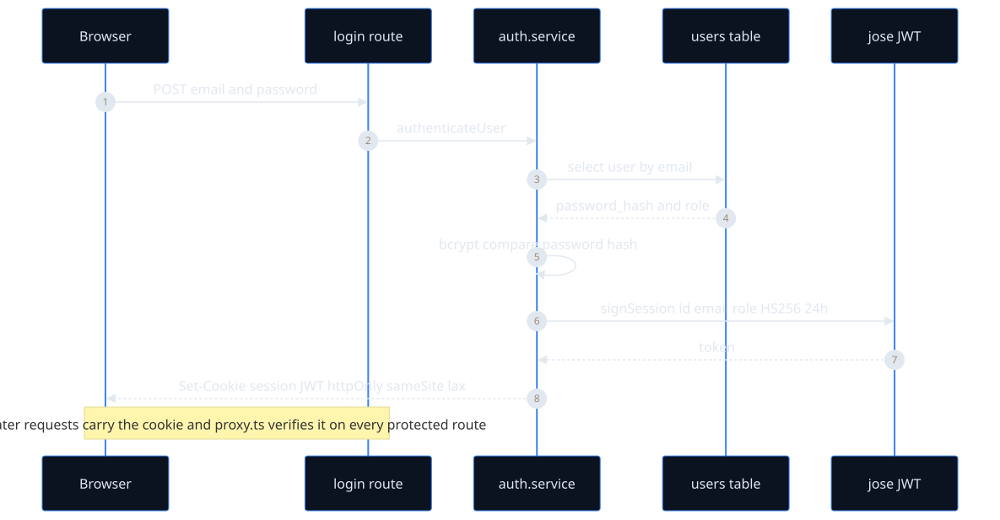

# PB Manager — Project Documentation

**PB Manager** (branded **MB Groups**) is an internal web application for running a grain/maize
trading business. It tracks the full cycle of the business: buying grain from farmers, moving it
via transport (bilty), selling it to buyer companies, generating bills and tax-style invoices,
recording expenses, and managing gunny-bag (jute sack) purchases — all with payment tracking and
Excel import/export.

This document is the **single, complete reference** for the project: what it does, how it's built,
the data model, the main flows, and how to run and extend it. Every diagram is a rendered image so
it displays in any viewer. A more focused architecture-only doc lives at
[`ARCHITECTURE.md`](ARCHITECTURE.md).

---

## Table of contents

1. [What the system does](#1-what-the-system-does)
2. [Technology stack](#2-technology-stack)
3. [Module map](#3-module-map)
4. [Modules in detail](#4-modules-in-detail)
5. [System architecture](#5-system-architecture)
6. [Feature-slice layering](#6-feature-slice-layering)
7. [Request lifecycle](#7-request-lifecycle)
8. [Authentication & authorization](#8-authentication--authorization)
9. [Route map](#9-route-map)
10. [Data model (ERD)](#10-data-model-erd)
11. [Key domain flows](#11-key-domain-flows)
12. [Dashboard & financial-year logic](#12-dashboard--financial-year-logic)
13. [Setup & running](#13-setup--running)
14. [Testing & quality](#14-testing--quality)
15. [Known limitations / hardening backlog](#15-known-limitations--hardening-backlog)
16. [Glossary](#16-glossary)
17. [Regenerating the diagrams](#17-regenerating-the-diagrams)

---

## 1. What the system does

The business buys grain, transports it, and resells it. PB Manager digitizes that pipeline:

- **Purchases** — record grain bought from farmers/suppliers (weight, rate, deductions, payment).
- **Bilty** — record transport consignments (similar shape to purchases, tied to a transport *party*).
- **Sales** — record grain sold to buyer companies, with pending-amount tracking.
- **Bills** — generate a bill from a purchase or bilty (idempotent, one source → one bill).
- **Sales invoices** — generate numbered, company-branded invoices from one or more sales, with a
  frozen snapshot for stable printing.
- **Companies** — manage issuer (own) and buyer company profiles, including bank/GST details.
- **Gunny bags** — track jute-sack purchases from sellers and the payments against them.
- **Expenses** — record operating costs by category (salary, vehicle, hamali, other).
- **Dashboard** — KPIs and trends, scoped to the current Indian financial year.

---

## 2. Technology stack

| Concern | Choice |
|---|---|
| Framework | **Next.js 16** (App Router) |
| UI runtime | **React 19** |
| Language | **TypeScript** |
| Database | **Supabase (Postgres)** — accessed server-side with the service-role key |
| Validation | **Zod** (schemas are the source of truth for types) |
| Forms | React Hook Form + `@hookform/resolvers` |
| UI kit | **shadcn-ui** + **Tailwind CSS v4**, `@tanstack/react-table` |
| Auth | **jose** (JWT) + **bcryptjs** (password hashing) |
| Excel | **xlsx** (SheetJS) for import/export |
| Dates | **date-fns** |
| Tests | **Vitest** |

---

## 3. Module map

How the business modules relate. Core data-entry modules feed billing/invoicing and the dashboard;
auth guards everything; Excel seeds and reports on the data.



---

## 4. Modules in detail

Each module is a self-contained slice under `src/features/<domain>/` with matching routes under
`src/app/<domain>/`.

### Purchases (`features/purchases`, `app/purchases`)
Buying grain. The form captures `weight`, `less_percent`, `rate`, plus deductions
(`bag_less`, `cash_paid`, `upi_paid`) and additions (`add_amount`). Derived values
(`less_weight`, `net_weight`, `amount`, `final_total`, `bag_avg`) are computed by a pure function and
recomputed on every write. Rows imported from the legacy Excel are marked `source = 'manual'` and are
protected from edit/delete. Bill numbers are sequenced **per financial year**.

### Bilty (`features/bilty`, `app/bilty`)
Transport consignments. Same numeric shape as purchases, but tied to a **party** (transport agent),
managed under `/bilty/parties` with their own party-level payment ledger (`bilty_party_payments`).

### Sales (`features/sales`, `app/sales`)
Selling grain to buyer companies. Tracks `bill_number` (unique), dispatch details (truck/tractor,
lorry number, destination), amounts, and `pending_amount`. Sales can be **imported from an Excel BILL
sheet** (admin-only) and are the input to invoice generation.

### Bills (`features/bills`, `app/bills`)
A bill is generated from a purchase or bilty with a **deterministic id** (`PUR_BILL_<id>`), making
generation idempotent. Stores `bill_date`, `net_weight`, `rate`, `freight`, `payment_term_days`, and a
computed `due_date`. Has a printable A4 layout.

### Companies & Sales Invoices (`features/companies`, `features/sales` invoices)
Companies are either **issuer** (your own trading entities, with bank/GST/`invoice_prefix`) or
**buyer**. Sales invoices bundle one or more sales into a numbered document
(`PREFIX-0001`), using an **atomic Postgres counter** per issuer, and freeze a `snapshot_json` of all
parties and line items so reprints never change. Company payments are recorded and **allocated**
across sales (`company_payment_allocations`).

### Gunny Bags (`features/gunny`, `app/gunny`)
Jute-sack purchases from **sellers**. Each `gunny_bags` row has bags/rate/amount and a `paid_amount`;
seller-level payments (`gunny_seller_payments`) are **allocated** across multiple gunny records
(`gunny_payment_allocations`) — the allocation pattern that mirrors company payments.

### Expenses (`features/expenses`, `app/expenses/[tab]`)
Operating costs in four categories — `salary`, `vehicle`, `hamali`, `other` — with an optional
linked **employee** (`expense_employees`). Tabbed UI: overview, salary, vehicle, hamali, other.

### Dashboard (`features/dashboard`, `app/dashboard`)
Aggregates purchases, bilty, sales, and buyer companies into KPIs and a purchase-trend chart, scoped
to the current financial year (see §12).

### Auth (`features/auth`)
Login/logout, JWT session, role guards. See §8.

---

## 5. System architecture

There is no separate backend service. **Next.js *is* the backend.** The browser never talks to
Supabase directly — every read/write goes through the server (a Server Action or a Route Handler)
using the service-role key, which never ships to the client bundle.



---

## 6. Feature-slice layering

Every domain follows the **same four-part shape**, which is the backbone of the codebase.



| Layer | Responsibility | Rule |
|-------|----------------|------|
| `schemas/` | Zod validation + inferred types | **Single source of truth** for shape |
| `utils/` | Pure derivations (net weight, totals) | No I/O, unit-tested |
| `service/` | All Supabase reads/writes + auth guards | Server-only; recomputes derived fields |
| `components/` | Forms & tables | Client; call Server Actions |
| `app/.../actions.ts` | Thin RPC boundary | `parse()` then delegate to the service |

---

## 7. Request lifecycle

A write flows: **UI → Server Action → Zod parse → service (auth + calc) → Postgres.** Validation
happens twice on the server (Zod, then DB constraints); auth is enforced inside the service for
defense in depth.



---

## 8. Authentication & authorization

- Sessions are **stateless JWTs** signed with `SESSION_SECRET` (HS256, 24h), stored in an **httpOnly,
  sameSite=lax** cookie. No server-side session store.
- Passwords are **bcrypt** hashes in the `users` table.
- [`proxy.ts`](../src/proxy.ts) middleware gates every route: unauthenticated users → `/login`,
  authenticated users on `/login` → `/dashboard`, `/` → dashboard-or-login.
- Roles are `admin` and `operator`; services call `requireAuth()` / `requireRole([...])`.
- Public routes: `/login`, `/api/auth/login`.



---

## 9. Route map

Navigation is defined in [`src/components/layout/Sidebar.tsx`](../src/components/layout/Sidebar.tsx).



---

## 10. Data model (ERD)

18 tables (+ sequences and one RPC) defined in [`supabase/schema.sql`](../supabase/schema.sql).



**Modeling notes**
- `purchases` / `bilty` carry **denormalized** `name / place / mob` rather than a hard FK to a party table.
- `gunny_bags.seller` is a **free-text name** (matched to `gunny_sellers` by name, not by FK).
- The three `*_payment_allocations` tables (`company_`, `gunny_`, plus the `bilty_party_payments`
  ledger) implement the "one payment, many records" split.
- Money columns are `numeric`; some are read back as strings and coerced server-side (`n()` helper).

---

## 11. Key domain flows

### 11.1 Bill generation (idempotent)
```
purchase  →  bill id = "PUR_BILL_<purchaseId>"  →  upsertBillById(...)
```
Because the id is derived from the source row, the `upsert` makes generation idempotent — one
purchase always resolves to exactly one bill.

### 11.2 Sales invoice numbering (concurrency-safe)
Per-issuer invoice sequence uses an **atomic Postgres RPC** (`next_company_invoice_seq`) — an
`INSERT ... ON CONFLICT DO UPDATE ... RETURNING` — so concurrent generation cannot collide. The
invoice stores a `snapshot_json` of issuer/buyer/items so reprints stay stable.


### 11.3 Payment allocation (gunny & companies)
A single payment is recorded once and **split across multiple records**:
```
seller_payment (₹50,000)
   ├─ allocation → gunny_bags A : ₹30,000
   └─ allocation → gunny_bags B : ₹20,000
```

---

## 12. Dashboard & financial-year logic

The Indian **financial year runs April 1 → March 31**. `getFinancialYearBounds()`
([`lib/financial-year.ts`](../src/lib/financial-year.ts)) computes the bounds for any date, and the
dashboard evaluates "now" in **IST** before filtering. Bill numbering and dashboard stats are both
FY-scoped, so counters reset each year.



KPIs include total purchase amount (purchases **+** bilty), purchased bags, total sales amount and
pending, and stock (purchased − sold), plus a purchase-trend chart.

---

## 13. Setup & running

### Environment variables (`.env` / `.env.local`)
```bash
SESSION_SECRET=replace_with_at_least_32_chars
NEXT_PUBLIC_SUPABASE_URL=https://YOUR_PROJECT.supabase.co
SUPABASE_SERVICE_ROLE_KEY=YOUR_SERVICE_ROLE_KEY
```
`lib/env.ts` validates these at boot with Zod and throws if invalid.

### Database
Run [`supabase/schema.sql`](../supabase/schema.sql) in the Supabase SQL editor. It creates all tables,
sequences, the invoice-counter RPC, and seeds `admin@gmail.com` / `operator@gmail.com`.

### Install & run
```bash
npm install
npm run dev        # http://localhost:3000
npm run build && npm run start   # production
```

### Scripts
| Command | Purpose |
|---|---|
| `npm run dev` | Dev server |
| `npm run build` / `start` | Production build / serve |
| `npm run lint` | ESLint |
| `npm run test` | Vitest (run once) |
| `npm run verify` | lint + test + build |

---

## 14. Testing & quality

- **Unit tests** (Vitest) cover the pure calculation utilities and number formatting:
  `features/bilty/utils/calculations.test.ts`, `features/sales/utils/calculations.test.ts`,
  `lib/number-format.test.ts`.
- **Type safety:** TypeScript throughout, with **zero `as any`** casts across the codebase.
- **Validation:** Zod at every Server Action boundary, plus DB constraints.

Gaps: services, Server Actions, and auth are not yet covered by tests (see §15).

---

## 15. Known limitations / hardening backlog

Documented so the trade-offs are explicit. None block a small, trusted-user deployment; they matter
at scale.

1. **No Row-Level Security.** All access uses the service-role key; protection is app-layer only.
   Add RLS + anon key for defense in depth.
2. **Read-modify-write bill numbers** for `purchases`/`bilty` (race-prone; relies on a unique-constraint
   error). Move to atomic sequences like `next_company_invoice_seq`.
3. **No multi-table transactions.** Invoice header+items uses a best-effort compensating delete;
   gunny payment+allocations can orphan a payment row on partial failure. Wrap in Postgres functions.
4. **No cache revalidation** (`revalidatePath`/`revalidateTag` unused) — freshness relies on refetch.
5. **Thin tests** — only pure calc functions are covered.
6. **Inconsistent error surfacing** — most actions throw raw DB error strings to the client.
7. **`SESSION_SECRET` has a dev fallback default** — must hard-fail in production.

---

## 16. Glossary

| Term | Meaning |
|---|---|
| **Bilty** | A transport consignment / goods-receipt note for moving grain. |
| **Gunny** | Jute sacks used to hold grain; bought from sellers as a separate line of business. |
| **Hamali** | Manual loading/unloading labor charges (an expense category). |
| **Bag avg** | Net weight ÷ number of bags. |
| **Less %** | Percentage weight deduction applied before computing amount. |
| **Issuer company** | Your own trading entity that issues invoices. |
| **Buyer company** | A customer company that buys grain. |
| **Allocation** | Splitting one payment across multiple records (bills/sales/gunny rows). |
| **Financial year** | April 1 → March 31 (India); resets bill counters and dashboard scope. |
| **Source = manual** | A row imported from legacy Excel; protected from in-app edit/delete. |

---

## 17. Regenerating the diagrams

Diagram sources are the `.mmd` files in [`diagrams/`](diagrams/); the committed `.svg` files are
rendered output (`@mermaid-js/mermaid-cli` is a devDependency).

```bash
for f in docs/diagrams/*.mmd; do
  npx mmdc -i "$f" -o "${f%.mmd}.svg" \
    -c docs/diagrams/mermaid-theme.json -b transparent
done
```

> On macOS the renderer uses the system Chrome via a Puppeteer config
> (`executablePath` → `/Applications/Google Chrome.app/...`). Adjust for your OS if needed.

---

### Diagram index

| File | Shows |
|---|---|
| `diagrams/01-high-level.svg` | System architecture |
| `diagrams/02-feature-slice.svg` | Per-domain layering |
| `diagrams/03-request-lifecycle.svg` | Mutation end-to-end |
| `diagrams/04-auth.svg` | Login / session |
| `diagrams/05-route-map.svg` | All routes |
| `diagrams/06-erd.svg` | Data model |
| `diagrams/07-invoice-flow.svg` | Invoice generation |
| `diagrams/08-module-map.svg` | Business module relationships |
| `diagrams/09-dashboard.svg` | Dashboard aggregation |
</content>
